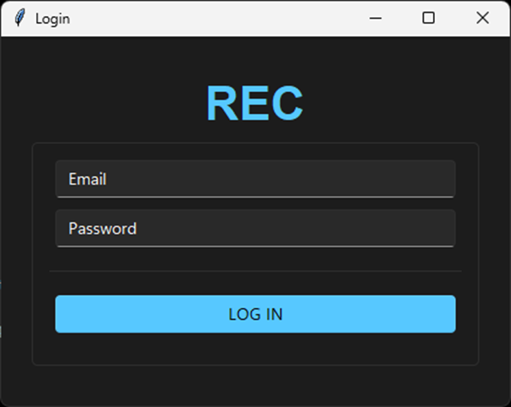
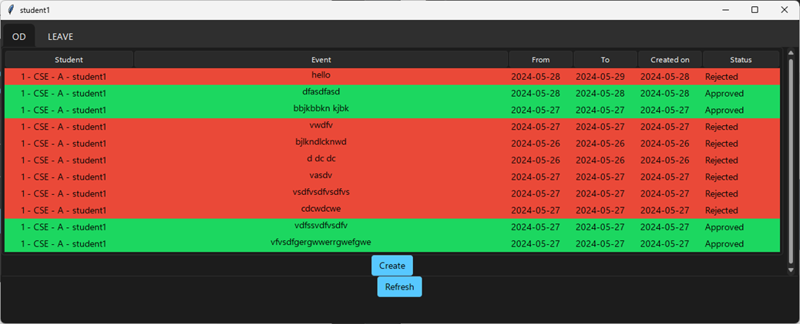
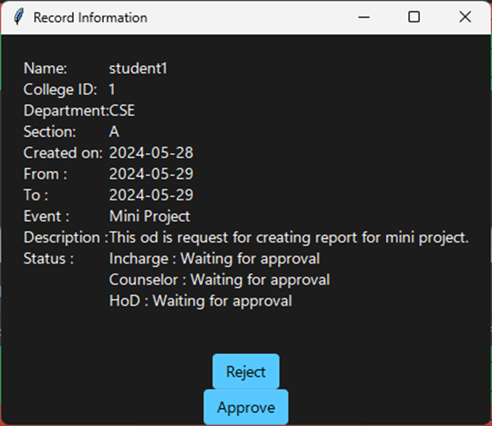

# 220701306-CS19443-DBMS-Lab

## OD AUTOMATION
The OD request automation is an application for assisting a class incharge in managing OD list of students of their class. The system would provide basic set of feature to request OD for a student, decline/approve OD request of a student for a class incharge, counselor and Head of department and view list of student who got OD on particular day.

 OD request automation is a typical management information system (MIS), its development include the establishment and maintenance of back-end database and front-end application development aspects. For the former require the establishment of data consistency and integrity of the strong data security and good libraries. As for the latter requires the application full functional, easy to use and so on.

## Techstack 🧑‍💻
- Tkinter (Python)
- Supabase Realtime Database (Posgresql)

## Steps to Run 🏃‍♂️
1. Change current working directory to app
    ```
    cd 220701306-CS19443-DBMS-Lab/"Mini Project"/Code
    ```
2. Add your ouwn credentials in **configs.py**
3. Run the main file
    ```
    python login.py
    ```

## Preview 🖼️
1.Login

2.Status of student

3.Creating OD

4.Staff Status

5.Staff Accepting or Decline OD

6.Forwarding OD to Counselor

7.Forwarding Od to HOD

8.Approved OD 

9.List of Student Obtained OD


## Contributors
1. Tharun RL (220701302)
2. Udhaya Shankar J (220701306)

`Contributions are always welcomed!`
